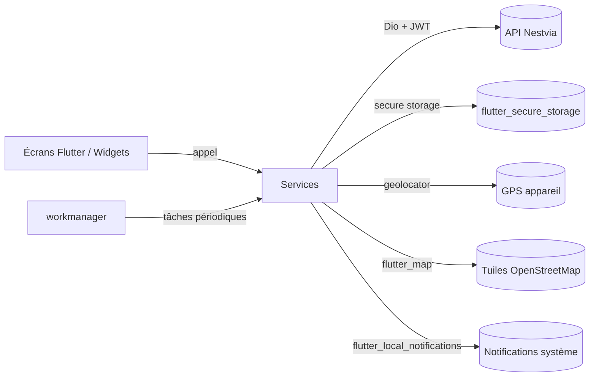

# Éléments techniques de l'application mobile Nestvia

Ce document récapitule les briques techniques utilisées par l'application mobile **Nestvia** (location de biens immobiliers) ainsi que leur rôle et leur fonctionnement.

---

## 1. Framework et langage

### Flutter (SDK Dart `^3.11.0`)
- Framework cross-platform de Google permettant de produire à partir d'une seule base de code des applications Android, iOS, web, Linux, macOS et Windows.
- Utilise le langage **Dart** et un moteur de rendu propre (Skia/Impeller) qui dessine chaque pixel, garantissant une UI cohérente sur toutes les plateformes.
- L'application est construite autour du widget racine `NestviaApp` (`MaterialApp`) défini dans [lib/main.dart](nestvia/lib/main.dart).

### Material 3
- `useMaterial3: true` active la dernière itération du design system de Google.
- Deux thèmes (`ThemeData` clair et sombre) sont déclarés et basculés dynamiquement via `ThemeService` (pattern `ChangeNotifier`).

---

## 2. Architecture du code

Le code applicatif est organisé en couches sous `lib/` :

| Dossier | Rôle |
|---|---|
| `config/` | Configuration globale (URL de l'API dans `api_config.dart`). |
| `models/` | Classes de données (`Property`, `Review`) utilisées pour désérialiser les réponses de l'API. |
| `services/` | Couche métier : appels HTTP, authentification, géolocalisation, notifications, gestion d'état léger via `ChangeNotifier`. |
| `screens/` | Écrans de l'application (auth, accueil, carte, détail bien, réservation, profil, etc.). |
| `widgets/` | Composants UI réutilisables (cartes de biens, popups, dialogues d'avis). |
| `main.dart` | Point d'entrée : initialise les services natifs avant `runApp`. |

Le pattern dominant est celui d'un **service singleton + StatefulWidget** : chaque service expose des méthodes asynchrones et notifie l'UI via `ChangeNotifier` lorsque pertinent (thème, favoris, filtres de recherche).

---

## 3. Communication avec l'API

### Dio (`dio: ^5.8.0`)
- Client HTTP riche utilisé dans `api_service.dart` pour dialoguer avec le back-end REST Nestvia.
- Avantages exploités : intercepteurs (injection automatique du token d'accès, refresh transparent en cas de 401), gestion fine des erreurs, timeouts, support du multipart pour l'upload.
- Voir [docs/interactions-application-api.md](nestvia/docs/interactions-application-api.md) pour le détail des endpoints.

### Authentification JWT + Refresh Tokens
- `auth_service.dart` gère la connexion, l'inscription et le rafraîchissement de session.
- Stratégie *access token court / refresh token long* documentée dans [docs/refresh-tokens.md](nestvia/docs/refresh-tokens.md).

### flutter_secure_storage (`^9.2.4`)
- Stockage chiffré des jetons (Keystore Android, Keychain iOS).
- Évite que les tokens soient lisibles en clair sur l'appareil, contrairement à `SharedPreferences`.

---

## 4. Géolocalisation et cartographie

### geolocator (`^13.0.4`)
- Récupère la position GPS de l'utilisateur (`location_service.dart`), gère les permissions runtime et l'activation des services de localisation.
- Utilisé pour le calcul de distance et le filtrage des biens à proximité (cf. [docs/filtrage-biens-proximite.md](nestvia/docs/filtrage-biens-proximite.md) et [docs/recuperation-traitement-donnees-gps.md](nestvia/docs/recuperation-traitement-donnees-gps.md)).

### geocoding (`^3.0.0`)
- Conversion adresse ↔ coordonnées (forward / reverse geocoding) pour afficher des libellés lisibles à partir des `lat/lng` retournés par l'API.

### flutter_map (`^7.0.2`) + latlong2 (`^0.9.1`)
- Carte interactive basée sur **OpenStreetMap** (alternative libre à Google Maps, pas de clé API ni de facturation).
- Utilisée dans `map_screen.dart` pour afficher les biens via des markers et le popup `property_popup.dart`.
- `latlong2` fournit le type `LatLng` requis par `flutter_map`.

---

## 5. Notifications

### flutter_local_notifications (`^17.2.3`)
- Planification et affichage de notifications locales (rappels de réservation, alertes).
- Initialisé au démarrage via `NotificationService().initializeLocalPush()` dans `main.dart`.

### workmanager (`^0.9.0+3`)
- Planificateur de tâches **en arrière-plan** (WorkManager côté Android, BGTaskScheduler côté iOS).
- `background_notification_service.dart` y enregistre un job périodique qui interroge l'API pour générer des notifications même lorsque l'application est fermée.
- Détails du flux dans [docs/systeme-notifications-push.md](nestvia/docs/systeme-notifications-push.md).

---

## 6. Interface et UX

### cached_network_image (`^3.4.1`)
- Téléchargement et mise en cache disque/mémoire des photos de biens, avec placeholders et gestion d'erreur. Réduit la consommation data et améliore la fluidité du scroll.

### cupertino_icons (`^1.0.8`)
- Jeu d'icônes iOS-style en complément des Material Icons.

### url_launcher (`^6.3.1`)
- Ouverture d'URLs externes (tel:, mailto:, liens web, itinéraires) depuis l'application.

### Localisation FR
- `flutter_localizations` + `intl: ^0.20.2` configurent l'app exclusivement en français (`Locale('fr', 'FR')`).
- `initializeDateFormatting('fr_FR')` charge les symboles de dates français pour les formats `DateFormat`.

---

## 7. Navigation

- `NavigationService` expose un `GlobalKey<NavigatorState>` (`navigatorKey`) injecté dans `MaterialApp`.
- Permet de déclencher des navigations **hors contexte widget** (depuis un service, un handler de notification, un callback workmanager).
- Le splash (`SplashScreen`) joue le rôle de routeur initial : vérification du token puis redirection vers `LandingScreen` ou `MainNavScreen`.

---

## 8. Plateformes cibles et configuration native

| Plateforme | Dossier | Particularités |
|---|---|---|
| Android | `android/` | Gradle (Kotlin DSL), permissions `INTERNET`, `ACCESS_FINE_LOCATION`, `POST_NOTIFICATIONS`, `RECEIVE_BOOT_COMPLETED` (workmanager). |
| iOS | `ios/` | Xcode workspace, clés `Info.plist` pour la géolocalisation (`NSLocationWhenInUseUsageDescription`) et les notifications. |
| Web / Desktop | `web/`, `linux/`, `macos/`, `windows/` | Scaffolds générés par Flutter, non prioritaires fonctionnellement. |

---

## 9. Qualité de code

- **flutter_lints (`^6.0.0`)** : ensemble de règles statiques officielles, activées via `analysis_options.yaml`.
- **flutter_test** : framework de tests widget (un test d'exemple dans [test/widget_test.dart](nestvia/test/widget_test.dart)).

---

## 10. Schéma global de fonctionnement

L'utilisateur interagit avec les écrans, qui délèguent aux services. Ceux-ci appellent l'API via Dio (avec authentification JWT et refresh automatique), persistent les jetons de manière chiffrée, exploitent les capteurs natifs (GPS, notifications) et bénéficient de l'exécution en tâche de fond grâce à WorkManager.

---

## Références internes

- [Spécifications fonctionnelles](nestvia/docs/specifications-fonctionnelles.md)
- [Fonctionnalités](nestvia/docs/fonctionnalites.md)
- [API](nestvia/docs/API.md)
- [Interactions application ↔ API](nestvia/docs/interactions-application-api.md)
- [Refresh tokens](nestvia/docs/refresh-tokens.md)
- [Connexion base de données](nestvia/docs/connexion-base-de-donnees.md)
- [Récupération et traitement GPS](nestvia/docs/recuperation-traitement-donnees-gps.md)
- [Filtrage des biens à proximité](nestvia/docs/filtrage-biens-proximite.md)
- [Système de filtres](nestvia/docs/systeme-de-filtres.md)
- [Système de réservation](nestvia/docs/systeme-de-reservation.md)
- [Système de notifications push](nestvia/docs/systeme-notifications-push.md)
